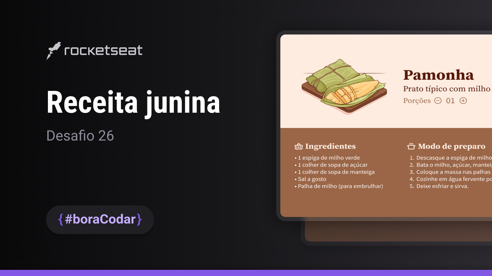

## Projeto

Esse é um projeto de receita conhecido em festas juninas

## Tecnologias

- HTML
- CSS
- JavaScript
- Git e GitHub

## Layout

Você pode visualizar o Layout do projeto através [Desse link](https://www.figma.com/community/file/1255887923488942888/Receita-Junina-%E2%80%A2-Desafio-26)
é necessario ter uma conta no [Figma](https://www.figma.com/login)